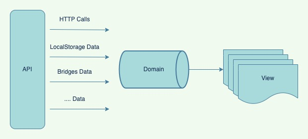
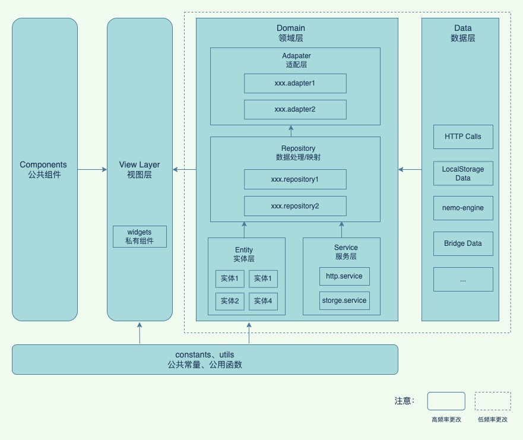

# DDD 在前端领域的思考和落地

## 现状

- 问题域本身错综复杂
- 知识的丢失
- 视图层代码分层模糊，过重
- 违反了代码重复原则，后期需要统一修改时，涉及文件多成本大
- 团队中各成员形成"知识不同步"，同样的功能 A B 都实现了，但是互相却不知道
- C 端的 UI 层复用性比较差，需求个性化严重
- 数据层的逻辑代码复用性不高

## 达到的目的

- **沉淀业务**：充分抽离业务逻辑代码，充分为视图服务。保证视图层足够"薄"。不写重复逻辑。
- **稳定模型**：统一且预处理好的数据逻辑，开发者可以直接使用数据而无需关注处理过程。前端字段不受后端影响。
- **关注点分离**：将属于不同模块的功能分散到合适的位置中，同时尽量降低各个模块的相互依赖并且减少需要联系的胶水代码，从而降低前端的复杂性。

## 前端流程

_数据层 -> 逻辑层 -> 视图层_

数据层生产数据，视图层消费数据。逻辑层的主要作用是调度，将数据层的结果实例化为运行时数据，这些运行时数据将被作为视图状态，用于渲染到界面中。同时，它接收人机交互信号，调度状态变化，协调视图层各个部分做出响应。于此同时，它还可能将状态数据转化为实体数据，通过调用数据层通道，将数据发送回源头，并获取新数据，以再次完成向视图层输送数据原料的任务。所以，**数据层处理原始数据，逻辑层生产运行时数据，视图层消费运行时数据**。逻辑层的处理，引用 **领域（domain）** 的概念来实现：

1. Domain：处理业务数据逻辑，最大程度提高代码的复用性
2. View：处理视图层的交互逻辑，比如，路由跳转，事件等

 

后端数据（Data） -> Repository 数据映射层(Model-Mapper) -> 前端领域对象 FDO(FrontEnd Domain Object) -> 数据转换层（Adapter）->提供给业务视图(Business View Model)使用

## 架构图



## 技术架构

### 整体架构设计

本项目采用 **领域驱动设计（DDD）** 在前端领域的实践，构建了一个完整的技术架构体系：

```
domain-front/
├── packages/
│   ├── domain-pet-store/          # 领域业务包
│   ├── interface-pet-store/       # 接口 SDK 包
│   └── interface-utils/           # 工具包
└── playground/                    # 应用示例
```

### 核心包说明

#### 1. @domain/domain-pet-store

**领域业务包** - 实现具体的业务逻辑和领域模型

- **领域模型**：定义业务实体和值对象
- **仓储层**：数据访问抽象，隔离外部数据源
- **服务层**：业务逻辑编排和协调
- **适配器层**：对外接口适配，处理数据转换

#### 2. @domain/interface-pet-store

**接口 SDK 包** - 基于 Swagger 自动生成的 API 接口层

- **自动生成**：基于 Swagger 规范自动生成 TypeScript 接口
- **类型安全**：完整的 TypeScript 类型支持
- **拦截器**：请求/响应拦截器支持
- **Mock 支持**：开发环境 Mock 数据支持

#### 3. @domain/interface-utils

**工具包** - 提供通用的工具函数和类型判断

- **类型判断**：完整的 JavaScript 类型判断工具
- **数据处理**：安全的 JSON 解析、对象扁平化等
- **HTTP 工具**：状态码检查、响应日志等
- **Tree-shaking**：支持按需引入，优化打包体积

## 特性

- 技术框架无关性，和采用什么技术框架没有什么关系
- UI 无关性
- 逻辑代码可测试
- 目录即分层

作为一个普通（不分前后端）的开发人员，我们关注于业务逻辑的抽离，让业务逻辑独立于框架。而在前端的实现，则是让前端的业务逻辑，可以独立于框架，只让 UI（即表现层）与框架绑定。一旦，我们更换框架的时候，只需要替换这部分的业务逻辑即可。

## 领域层分层

```
.
├── pet
│   ├── adapter
│   │   └── pet.adapter.js
│   ├── service
│   │   └── pet.service.js
│   ├── model
│   │   └── pet.entity.js
│   └── repository
│       ├── pet.repository.js
│       └── mapper
│           └── pet.mapper.js
└── sharedUtils
    ├── const.js
    └── index.js

```

- **pet**： 核心业务模型，这里以 pet 为例
- **adapter**： 做数据清洗。逻辑判断、数据筛选、数据转换等。供视图层调用。业务的缓冲层，第二层防腐层(主适配器)
- **service**：放置 http 请求，本地存储/读取数据等，处理成 Result Pattern 结构
- **model**：数据实体，简单的数据模型，用来表示核心的业务逻辑，为视图提供所需字段，全局统一
- **repository**：Repository，用于读取和存储数据。隔离后端服务与模型，第一层防腐层(次适配器)。暴露当处理异常时，默认使用的数据
  - **mapper**：映射层，用于核心实体层映射，或映射到核心实体层，异构转换。默认数据，及字段处理。使用者主要关注此。负责将接口请求到的 `entity` 转换成 `UI` 所需要的 `model` 数据
- **sharedUtils**：各模型共享常量、字典项和工具类函数

**备注：** _防腐层 Anti Corruption Layer_ 是领域驱动设计中的一个概念，用于隔离两个系统，允许两个系统之间在不知道对方领域知识的情况下进行集成。主要进行的是两个系统之间的模型（model）或者协议（protocol）的转换，并且最终目的是为了系统使用者的方便而不是系统提供者的方便，进一步的解释就是把系统提供者的模型转换为系统使用者的模型。在前端落地的话，就是上面提到的 `mapper` 映射层。

## 实现细节

### 1. 实体模型设计

```javascript
// pet.entity.js
export class PetEntity {
  constructor(params = {}) {
    this.id = params.id || 0;
    this.category = params.category || new CategoryEntity();
    this.name = params.name || '';
    this.photoUrls = params.photoUrls || [];
    this.tags = params.tags || [];
    this.status = params.status || 'available';
  }
}
```

**设计原则：**

- **不可变性**：实体对象一旦创建，其核心属性不应被修改
- **完整性**：实体包含完整的业务状态
- **一致性**：实体内部状态保持一致

### 2. 映射层实现

```javascript
// pet.mapper.js
export class PetMapper {
  mapFrom(params) {
    const categoryMapper = new CategoryMapper();
    const tagMapper = new TagMapper();

    return new PetEntity({
      id: params.id,
      category: params.category ? categoryMapper.mapFrom(params.category) : new CategoryEntity(),
      name: params.name,
      photoUrls: params.photoUrls || [],
      tags: params.tags ? params.tags.map((tag) => tagMapper.mapFrom(tag)) : [],
      status: params.status
    });
  }
}
```

**映射职责：**

- **数据转换**：将外部数据格式转换为内部实体格式
- **默认值处理**：为缺失字段提供合理的默认值
- **类型安全**：确保数据类型的正确性

### 3. 仓储层设计

```javascript
// pet.repository.js
export async function getPetByIdRepository(params) {
  const mapper = new PetMapper();
  const [error, result] = await getPetByIdService(params);

  if (error) {
    return [error, mapper.mapFrom({})];
  }

  return [null, mapper.mapFrom(result)];
}
```

**仓储模式优势：**

- **数据访问抽象**：隐藏具体的数据源实现
- **错误处理统一**：统一的错误处理和默认值返回
- **缓存策略**：可以在仓储层实现缓存逻辑

### 4. 适配器层实现

```javascript
// pet.adapter.js
export async function getPetByIdAdapter(params) {
  if (isMockMode()) {
    return [null, await fetchMockJson('pet/getPetByIdAdapter')];
  }
  return await getPetByIdRepository(params);
}
```

**适配器职责：**

- **环境适配**：根据运行环境选择不同的数据源
- **接口统一**：为视图层提供统一的接口
- **Mock 支持**：开发环境支持 Mock 数据

## 实践

### 请求接口统一处理

HTTP 接口返回统一的数据结构

```typescript
// 业务异常及http协议异常
interface IError {
  errorMsg: string;
  errorCode: number | string;
}

// 数据返回结构
interface IReq {
  data: any; // Array, Set, Map, 类数组等
  error: IError;
}
```

引入 `nemo-engine`生成的接口，比如

```typescript
import { petstore } from '@domain/pet-store-sdk/src/services/mods';
import to from 'await-to-js';
import { formatResponse } from '../../sharedUtils';

const $httpApi = petstore.pet;

/**
 * 添加新的宠物
 * @param params
 * @returns {Promise<*[]>}
 */
export async function addPetService(params) {
  const [error, result] = await to($httpApi.addPet(params));
  return formatResponse(error, result);
}
```

### 异常的处理

- HTTP 请求异常：(status >= 200 && status < 300) || status === 304（status 服务器响应的 HTTP 状态码）
- 业务数据异常：接口请求成功，但业务报异常，比如入参不对等。使用 `error`字段即可。 UI 层在处理异常时，使用 Result Pattern，提供了一个辅助方法来帮助使用该模式。通过 `[await-to-js](https://github.com/scopsy/await-to-js)`来转换。

```typescript
import to from 'await-to-js';

export async function result<T, U = Error>(promise: Promise<T>): Promise<[U | null, T | null]> {
  try {
    const data = await to(httpRequestPromise);
    return [null, data];
  } catch (err) {
    return [err];
  }
}
```

## 工具链与工程化

### 1. 代码生成工具

**Nemo Engine** - 基于 Swagger 规范的接口代码生成工具

```bash
# 生成 API 代码
npm run gen:nemo

# 扫描 API 变更
npm run scan:nemo

# 生成文档
npm run gen:docs
```

**特性：**

- **自动生成**：基于 Swagger 规范自动生成 TypeScript 接口
- **类型安全**：完整的类型定义和类型检查
- **版本管理**：支持 API 版本变更检测
- **文档生成**：自动生成 API 文档

### 2. 开发工具链

**Monorepo 架构** - 使用 pnpm workspace 管理多包项目

```json
// pnpm-workspace.yaml
packages:
  - 'packages/*'
  - 'playground'
```

**构建工具链：**

- **Vite**：现代化的构建工具，支持快速热更新
- **TypeScript**：类型安全的 JavaScript 超集
- **ESLint + Prettier**：代码规范和格式化
- **Husky + lint-staged**：Git hooks 和提交前检查

### 3. 测试策略

**分层测试** - 针对不同层级采用不同的测试策略

```javascript
// 单元测试 - 测试业务逻辑
describe('PetMapper', () => {
  it('should map pet data correctly', () => {
    const mapper = new PetMapper();
    const result = mapper.mapFrom(mockPetData);
    expect(result).toBeInstanceOf(PetEntity);
  });
});

// 集成测试 - 测试数据流
describe('PetRepository', () => {
  it('should handle API errors gracefully', async () => {
    const [error, result] = await getPetByIdRepository({ petId: 999 });
    expect(error).toBeTruthy();
    expect(result).toBeInstanceOf(PetEntity);
  });
});
```

## 最佳实践

> 需要不断总结，通过这部分代码评审获得

### 通用字段处理

1. 值为数字类型的 `YYYYMMDD` 时间字段格式统一做 `字符串` 格式处理
2. 数据字典转义
3. 前端页面描述语言（字段）（与接口没有必然联系）
4. Array 列表

```typescript
// 列表数据
Array<any>;
```

注意：如果是 Map 和 Array 结合的，还是需要保留 records。列表的 key 统一为 records。如

```json
{
  "records": [
    {
      "id": 1,
      "category": {
        "id": 1,
        "name": "Dogs"
      },
      "name": "doggie",
      "photoUrls": ["http://example.com/photo1.jpg"],
      "tags": [
        {
          "id": 1,
          "name": "friendly"
        }
      ],
      "status": "available"
    },
    {
      "id": 2,
      "category": {
        "id": 2,
        "name": "Cats"
      },
      "name": "kitty",
      "photoUrls": ["http://example.com/photo2.jpg"],
      "tags": [
        {
          "id": 2,
          "name": "cute"
        }
      ],
      "status": "available"
    }
  ]
}
```

注意：如果是返回是状态相关的，key 统一重命名为 state，默认值统一为 -1。如

```json
{
  "state": 0
}
```

5. 视图使用时，无需关注使用字段的边界情况（统一在领域层处理）
6. 不在`template`模板里使用 `filter`方法
7. 列表数据要给个唯一值，如果接口有返回的话，记得添加下这个字段，不管视图有没有使用。作为 for 循环的时候 key
8. 消灭魔法值
9. 系统中相同语义的字段保持同名（例如 productCode，productName 等）
10. 返回的字段，尤其是处理过的，比如保留位数的 fixedNum(params.unit_nv, 4) 。如果出现了别家券商保留位数不一致，可以再实体增加一个新的字段，并以 Original 结尾，如 unitNvOriginal

### 设计原则

#### 1. 单一职责原则

每个类和方法只负责一个明确的职责

```javascript
// ✅ 好的设计
class PetMapper {
  mapFrom(params) {
    /* 只负责数据映射 */
  }
}

class PetValidator {
  validate(params) {
    /* 只负责数据验证 */
  }
}

// ❌ 不好的设计
class PetManager {
  mapFrom(params) {
    /* 数据映射 */
  }
  validate(params) {
    /* 数据验证 */
  }
  saveToCache(params) {
    /* 缓存处理 */
  }
}
```

#### 2. 开闭原则

对扩展开放，对修改关闭

```javascript
// ✅ 可扩展的设计
class BaseMapper {
  mapFrom(params) {
    return this.transform(params);
  }

  transform(params) {
    throw new Error('transform method must be implemented');
  }
}

class PetMapper extends BaseMapper {
  transform(params) {
    return new PetEntity(params);
  }
}
```

#### 3. 依赖倒置原则

依赖抽象而不是具体实现

```javascript
// ✅ 依赖抽象
class PetRepository {
  constructor(dataSource) {
    this.dataSource = dataSource;
  }

  async getPetById(id) {
    return await this.dataSource.fetch(`/pets/${id}`);
  }
}

// 可以注入不同的数据源
const httpRepository = new PetRepository(httpDataSource);
const mockRepository = new PetRepository(mockDataSource);
```

### 性能优化

#### 1. 懒加载

按需加载领域模块

```javascript
// 动态导入领域模块
const PetModule = await import('@domain/domain-pet-store/pet');
const { getPetByIdAdapter } = PetModule;
```

#### 2. 缓存策略

在仓储层实现缓存逻辑

```javascript
class CachedPetRepository {
  constructor(repository, cache) {
    this.repository = repository;
    this.cache = cache;
  }

  async getPetById(id) {
    const cached = this.cache.get(`pet:${id}`);
    if (cached) return cached;

    const result = await this.repository.getPetById(id);
    this.cache.set(`pet:${id}`, result);
    return result;
  }
}
```

#### 3. 批量处理

减少网络请求次数

```javascript
class BatchPetRepository {
  constructor(repository) {
    this.repository = repository;
    this.batchQueue = [];
    this.batchTimer = null;
  }

  async getPetById(id) {
    return new Promise((resolve) => {
      this.batchQueue.push({ id, resolve });
      this.scheduleBatch();
    });
  }

  scheduleBatch() {
    if (this.batchTimer) return;

    this.batchTimer = setTimeout(() => {
      this.processBatch();
    }, 10);
  }
}
```

## 预期达到的目标

1. 视图层尽可能薄： 获得的数据能够直接使用到视图层中，禁止在视图层中对数据进行转换、筛选、计算等逻辑操作。
2. 不写重复逻辑：遇到相同的逻辑尽可能复用而不是重写，逻辑函数尽可能写成可拓展可维护，暴露给团队其他成员。
3. 不同职责的代码进行分层：将不同职责代码合理分层，每层尽可能纯净，互不影响。
4. 前端字段不受后端影响： 返回字段进行纠正，字段含义尽可能直观，在视图层使用时，能够更清晰地描述视图结构。
5. 可纵观全局领域： 前端进行领域模块结构设计时，能够纵览整个项目下所有的领域，以及每个领域下具有的逻辑功能。
6. 更为健壮、安全的 Model
7. 统一结构
8. 可以被复用或继承的
9. 可以预处理好所有数据逻辑，开发者可以直接使用数据而无需关注处理过程
10. 有清晰的成功失败判定逻辑
11. 提供安全的获取数据的逻辑
12. 视图使用 Model 时，无需关注使用字段的边界情况，如字段不存在，处理 null 等的情况
13. Logic（逻辑层）沉淀下来，View（视图层）稳定下来
14. 更方便的 Mock
15. 无论接口以何种形式返回数据、以何种数据格式返回数据，都不会间接对咱们的模型层代码进行毁坏，更不可能将这种破坏性穿透到 UI 层代码中

## 部署与运维

### 1. 构建优化

**多环境构建** - 支持开发、测试、生产环境

```javascript
// vite.config.ts
export default defineConfig({
  build: {
    rollupOptions: {
      output: {
        manualChunks: {
          'domain-pet-store': ['@domain/domain-pet-store'],
          'interface-utils': ['@domain/interface-utils']
        }
      }
    }
  }
});
```

**代码分割策略：**

- **领域包分离**：将不同领域包分别打包
- **工具库分离**：将通用工具库独立打包
- **动态导入**：按需加载领域模块

### 2. 监控与日志

**性能监控** - 监控领域层的性能表现

```javascript
// 性能监控装饰器
function performanceMonitor(target, propertyKey, descriptor) {
  const originalMethod = descriptor.value;

  descriptor.value = async function (...args) {
    const start = performance.now();
    try {
      const result = await originalMethod.apply(this, args);
      const duration = performance.now() - start;

      // 记录性能指标
      console.log(`${propertyKey} took ${duration}ms`);

      return result;
    } catch (error) {
      const duration = performance.now() - start;
      console.error(`${propertyKey} failed after ${duration}ms:`, error);
      throw error;
    }
  };

  return descriptor;
}
```

### 3. 错误处理

**全局错误处理** - 统一的错误处理机制

```javascript
// 错误边界
class DomainErrorBoundary {
  static handle(error, context) {
    // 记录错误日志
    console.error('Domain Error:', {
      error: error.message,
      stack: error.stack,
      context
    });

    // 返回默认值
    return this.getDefaultValue(context);
  }

  static getDefaultValue(context) {
    switch (context.type) {
      case 'pet':
        return new PetEntity();
      case 'list':
        return [];
      default:
        return null;
    }
  }
}
```

## 团队协作

### 1. 代码规范

**统一的代码风格** - 确保团队代码一致性

```javascript
// .eslintrc.js
module.exports = {
  extends: ['@winner-fed/eslint-config-vue', '@winner-fed/eslint-config-typescript'],
  rules: {
    // 领域层特定规则
    'no-magic-numbers': 'error',
    'prefer-const': 'error',
    'no-var': 'error'
  }
};
```

### 2. 文档规范

**API 文档** - 自动生成和维护文档

```javascript
// JSDoc 注释规范
/**
 * 获取宠物信息
 * @param {Object} params - 请求参数
 * @param {number} params.petId - 宠物ID
 * @returns {Promise<[Error|null, PetEntity]>} 返回宠物实体或错误
 * @example
 * const [error, pet] = await getPetByIdAdapter({ petId: 123 });
 * if (error) {
 *   console.error('获取宠物失败:', error);
 *   return;
 * }
 * console.log('宠物名称:', pet.name);
 */
export async function getPetByIdAdapter(params) {
  // 实现逻辑
}
```

### 3. 版本管理

**语义化版本** - 遵循语义化版本规范

```json
{
  "name": "@domain/domain-pet-store",
  "version": "1.2.3",
  "description": "宠物商店领域包"
}
```

**版本规则：**

- **主版本号**：不兼容的 API 修改
- **次版本号**：向下兼容的功能性新增
- **修订号**：向下兼容的问题修正

## 注意

领域层并不是因为被多个地方复用而被抽离。它被抽离的原因是：

- 领域层是稳定的（页面以及与页面绑定的模块都是不稳定的）
- 领域层是解耦的（页面是会耦合的，页面的数据会来自多个接口，多个领域）
- 领域层具有极高复杂度，值得单独管理(view 层处理页面渲染以及页面逻辑控制，复杂度已经够高，领域层解耦可以轻 view 层)
- 领域层以层为单位，可以复用（你的代码可能会抛弃某个技术体系，从 vue 转成 react，或者可能会推出一个移动版，在这些情况下，领域层这一层都是可以直接复用）
- 为了领域模型的持续衍进(模型存在的目的是让人们聚焦，聚焦的好处是加强了前端团队对于业务的理解，思考业务的过程才能让业务前进)

## 总结

通过领域驱动设计在前端领域的实践，我们构建了一个完整的技术架构体系：

1. **分层清晰**：通过明确的分层架构，实现了关注点分离
2. **技术无关**：领域层与具体技术框架解耦，提高了复用性
3. **类型安全**：完整的 TypeScript 支持，提高了代码质量
4. **工具完备**：完整的开发工具链，提高了开发效率
5. **规范统一**：统一的代码规范和最佳实践，提高了团队协作效率

这种架构设计不仅解决了当前面临的技术问题，更为未来的技术演进和业务发展奠定了坚实的基础。
